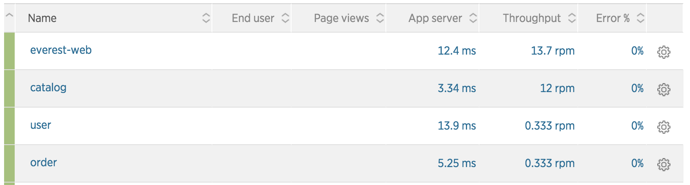
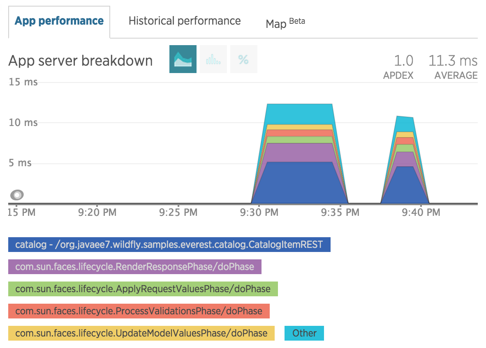
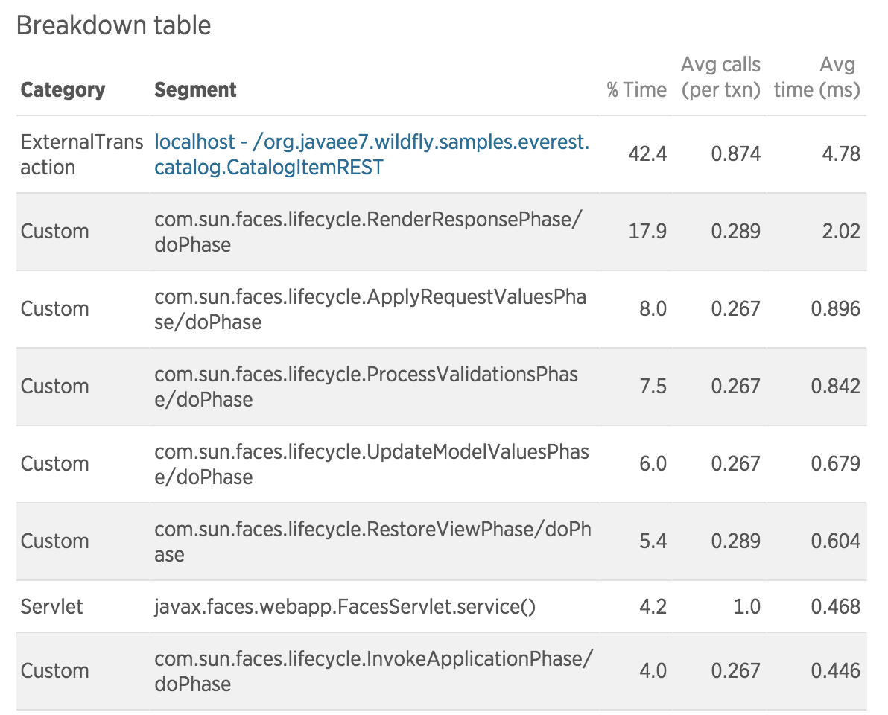
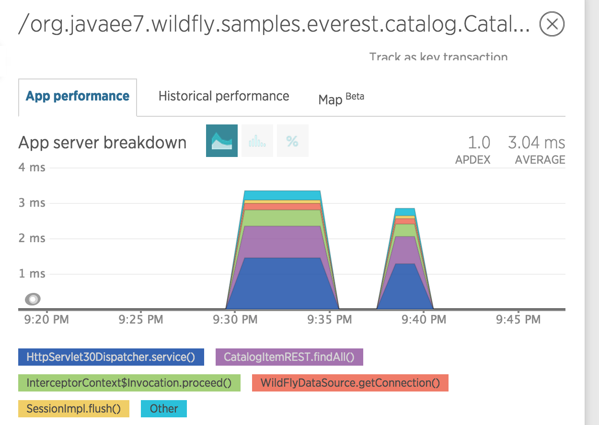
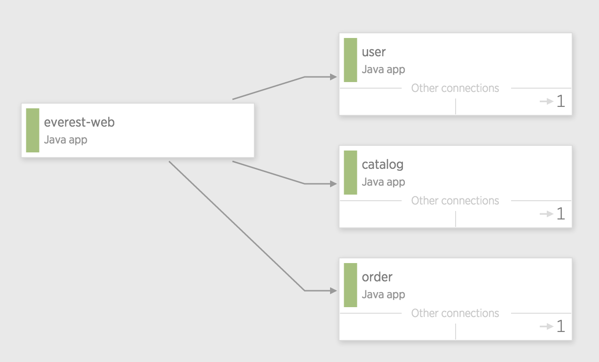

= Service Monitoring

== New Relic

=== Download and Configure Agent

. Sign up for a new account: https://newrelic.com/signup
. Login and select '`Get Started`'
. From '`Choose your language`', select '`Java`'
. Download the Java Agent zip file and unzip
. Configure the license in `newrelic.yml`
. Set `enable_auto_app_naming` to `true` in `newrelic.yml`. This will
  ensure that multiple microservices deployed in same instance of
  application server will be monitored in their own namespace. More
  details at: https://docs.newrelic.com/docs/agents/java-agent/configuration/automatic-application-naming

Complete details:
https://docs.newrelic.com/docs/agents/java-agent/installation/java-agent-self-installer

=== Setup WildFly

. Download WildFly from
  http://download.jboss.org/wildfly/9.0.1.Final/wildfly-9.0.1.Final.zip.
. WildFly installation for Java (standalone mode):
  https://docs.newrelic.com/docs/agents/java-agent/frameworks/wildfly-installation-java

=== Deploy the Application

. Clone the workspace: `git clone https://github.com/arun-gupta/microservices.git`
. Start WildFly application server: `./bin/standalone.sh`
. Change the directory to `microservice` and deploy as `mvn install -Pwildfly`
. Access the application at http://localhost:8080/everest-web
. Go through the application flow and shop around

=== Show Stats

. Access http://rpm.newrelic.com, select Applications to see the
  output
+

+
WARNING: The data shown in the dashboard is updated after a few seconds as it is collected every minute. There is no way to change this setting for now.
+
. Select an application, say "`everest-web`"
. Click on "`Transactions`", "`/Faces Servlet`" to see more details
  about the application:
+

+
. Scroll down and select on "`Breakdown table`" and show the %
  distribution
+

+
. Click on the first row (as that is most time consuming resource).
  This is also the external microservice that is being invoked.
+

+
. Click on "`Service Maps`" at the top to show how different services
  are interacting with each other:
+

+
WARNING: This service map is a snapshot of how different microservices
are interacting at the current moment. It does not provide historical data at this
time.

TODO:
. How to show the SQL query?
. Response times
. Errors and timeouts
. Request flow
. System resources  (CPU, network, disk)
. JVM pressure (threads GC, mem)
. Apdex score

